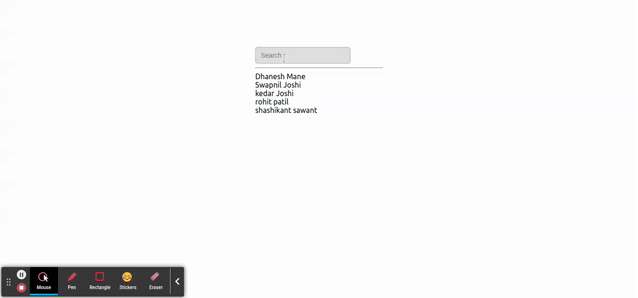

debounce effect integrate with the input element using functional component. You can refer the
component created in file DebounceReactInput.js

## Demo


## Live demo

[https://stackblitz.com/edit/react-debounce-input-functional](https://stackblitz.com/edit/react-debounce-input-functional)

## Usage
```js
import { useState } from "react";
import DebounceReactInput from "./DebounceReactInput";
import "./app.css";

const sampleData = [
  {
    first: "Dhanesh",
    last: "Mane",
  }
];

function App() {
  const [userList, setUserList] = useState(sampleData);

  return (
    <div className="App">
      <DebounceReactInput userList={userList} setUserList={setUserList} />
      <div>
        <hr />
        {userList.map((user) => {
          return (
            <div>
              {user.first} {user.last}
            </div>
          );
        })}
      </div>
    </div>
  );
}

export default App;

```
